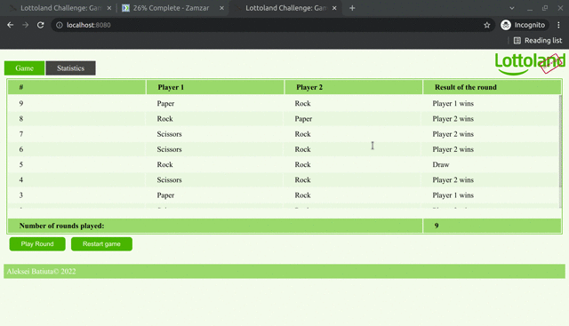

# Lottoland
The Test Challenge from Lottoland

# Developer Guide
1. Build and Start application: `mvn spring-boot:run`
2. Run Test Report: `mvn site` and report should be in `../target/site/index.html`
3. Run Maven command with _tests_ but without _checkstyle_: `mvn spring-boot:run -Pdev-test`
4. Run Maven command without _tests_ and _checkstyle_: `mvn spring-boot:run -Pdev`
> *Test Server starts on _8080_ port!*
# Test Cases
1. Open 'http://localhost:8080/' to view the rounds' statistics, 'Play Round' and 'Restart Game'
2. Open 'Statistics' page by click to coresponding menu item and verify the data for all users
