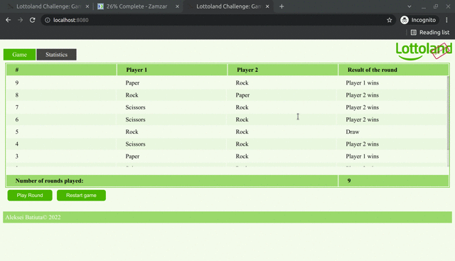

# Lottoland
The Test Challenge from Lottoland

# Developer Guide
1. Build and Start application: `mvn spring-boot:run`
2. Run Test Report: `mvn site` and report should be in `../target/site/index.html`. The actual report of the last release is on [Project Page](https://aleksei-batiuta.github.io/lottoland-challenge/) 
3. Run Maven command with _tests_ but without _checkstyle_: `mvn spring-boot:run -Pdev-test`
4. Run Maven command without _tests_ and _checkstyle_: `mvn spring-boot:run -Pdev`
> *Test Server starts on **8080** port!*
5. Project has correct _maven_ `release:prepare` and `release:perform` goals since 'v1.10'
6. Docker
   * Example of User Maven settings `~/.m2/settings.xml`
       ```
       <settings>
           <profiles>
               <profile>
                   <id>lottoland-challenge</id>
                   <repositories>
                       <repository>
                           <id>central</id>
                           <url>https://repo1.maven.org/maven2</url>
                           <releases>
                               <enabled>true</enabled>
                           </releases>
                           <snapshots>
                               <enabled>true</enabled>
                           </snapshots>
                       </repository>
                       <repository>
                           <id>lottoland-challenge</id>
                           <name>GitHub ${github.owner} Apache Maven Packages</name>
                           <url>https://maven.pkg.github.com/${github.owner}/lottoland-challenge</url>
                       </repository>
                   </repositories>
                   <properties>
                       <!-- GitHub repository owner-->
                       <github.owner>Aleksei-Batiuta</github.owner>
                       
                       <!-- DockerHub repository settings-->
                       <dockerhub.site>docker.io</dockerhub.site>
                       <dockerhub.owner>!!!Docker Hub Username!!!</dockerhub.owner>
                       <dockerhub.password>!!!Docker Hub User Password!!!</dockerhub.password>
                       <dockerhub.url>${dockerhub.site}/library/${dockerhub.owner}</dockerhub.url>
                   </properties>
               </profile>
           </profiles>
           <servers>
               <server>
                   <id>lottoland-challenge</id>
                   <username>!!!GitHub Username!!!</username>
                   <password>!!!GitHub User Token!!!</password>
               </server>
           </servers>
       </settings>
       ```
   * Build image 
   ```
   mvn spring-boot:build-image -P lottoland-challenge
   ```
   * Run Application
    * Maven goal  
    ```
    mvn spring-boot:run -Dspring-boot.run.profiles=debug -P lottoland-challenge
    ```
    * Run Docker image 
    ```
    docker-compose -f target/docker/docker-compose.yml up
    ```
    DEBUG
    ```
    docker run -p 8080:8080 -e "SPRING_PROFILES_ACTIVE=debug" -t alekseibatiuta/lottoland-challenge:0.28
    ```
# Test Cases
1. Open 'http://localhost:8080/' to view the rounds' statistics, 'Play Round' and 'Restart Game'
2. Open 'Statistics' page by click to corresponding menu item and verify the data for all users
# TODO
1. There are test cases with `null` description
2. Some classes have no author in javadoc
3. No general description of major parts of functionality
4. No Test cases of HTML pages validation
5. No Application Load Test
6. No redirect to default page when URL/Path was not found
7. The error page should be more informative
8. After removing the @Data annotation from Entity/VO classes those Objects have not friendly `toString()` method

# Hub Docker (@Deprecated)

This is a description of manual usage:
```
docker tag lottoland-challenge:0.20-SNAPSHOT lottoland-challenge:latest
docker tag lottoland-challenge:0.20-SNAPSHOT alekseibatiuta/lottoland-challenge:0.20-SNAPSHOT
docker push alekseibatiuta/lottoland-challenge:0.20-SNAPSHOT
```
